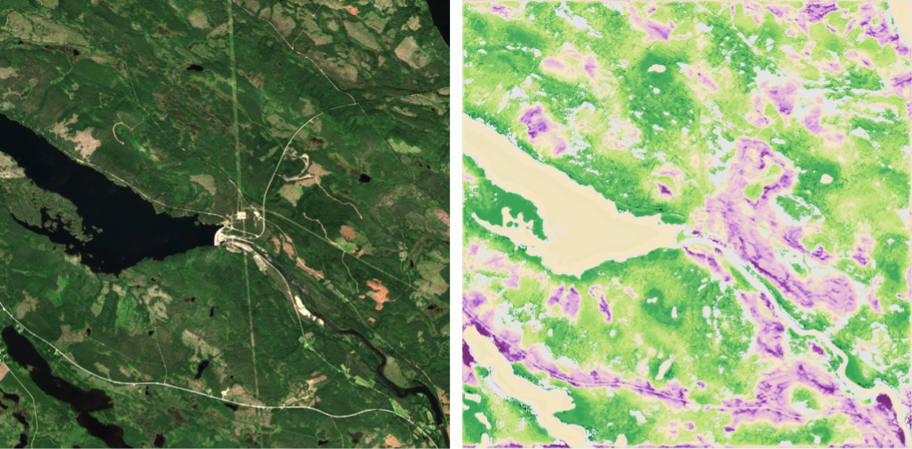

# Testbed-18: Task "Identifiers for Reproducible Science" - wilderness workflow

This repository is intended to be used with Whole Tale (https://wholetale.org/), i.e. on the Whole Tale platform a so-called tale can be created from it.  
The purpose of the tale is to reproduce (parts of) the scientific study "Exploring Wilderness Using Explainable Machine Learning in Satellite Imagery" which is described on https://arxiv.org/abs/2203.00379.

The source code is based on https://gitlab.jsc.fz-juelich.de/kiste/asos.

## Prerequisites

To run (parts of) the `51_analyze_samples.ipynb` notebook a pickle file is needed which can be downloaded from http://rs.ipb.uni-bonn.de/downloads/asos/. Because it's relatively large (~0,5 GB) we don't want to store it on GitHub.

The file `/logs/asos/asos.pkl` in the downloaded `asos_logs.zip` should be placed in `work_dir/logs/asos`.

## Data

The original data for the study can be downloaded from https://paperswithcode.com/dataset/anthroprotect. We use only samples to reproduce parts of the study. Data presented in the research article in figures 8, 9 and 10 are available from the following files:
* `investigative/inv_hydroelectric-letsi_2019-07-01-2019-08-30.tif` (Figure 8)
* `investigative/inv_valley-alvdal_2017-07-01-2017-08-30.tif` (Figure 9, 2017)
* `investigative/inv_valley-alvdal_2020-07-01-2020-08-30.tif` (Figure 9, 2020)
* `investigative/inv_forest-planted-1_2018-07-01-2018-08-30.tif` (Figure 10)

Instead of using files data can also be downloaded from any OGC Coverage API which is serving Sentinel-2 data including bands B2, B3, B4, B5, ,B6, B7, B8, B8A, B11 and B12. For applied preprocessing check the research article.

## Configuration

The repository is configured to run on Whole Tale without any changes needed. To run it somewhere else, the configuration can be changed either using the `main_config.py` or by setting the following environment variables:

* WORKING_DIR=
  * *Logging files, model checkpoints and figures will be saved here and will be loaded from here. If you have already a trained model, put the 'logs' folder into this working_dir.*
  * Default: `/home/jovyan/work/workspace/work_dir`
* DATA_FOLDER=
  *  *Define the path to the anthroprotect dataset folder.*
  * Default: `/home/jovyan/work/workspace/data/anthroprotect`
* NUM_WORKERS=
  * *Define the number of workers to load data while training the model and running model predictions.*
  * Default: `8`
* DEVICE=
  * *Define which device is available and should be used ('cuda', 'cuda:<cuda_id>' or 'cpu').*
  * Default: `'cpu'`
* SERVER_URL=
  * *Define the url of a server providing data via API Coverages*
  * Default: `'https://18.testbed.dev.52north.org/geodatacube/'`

## Run workflow

To download samples for analysis run `tjects/experiments/testbed18/00_download_samples.ipynb`.

To predict activation maps and sensitivity maps from Sentinel-2 imagery to analyze wilderness characteristics run `tjects/experiments/testbed18/51_analyze_samples.ipynb`.

## Additional notes

* The asos folder (with only `__init__.py` and `modules.py`) needs to be in place to unpickle the model checkpoints.
